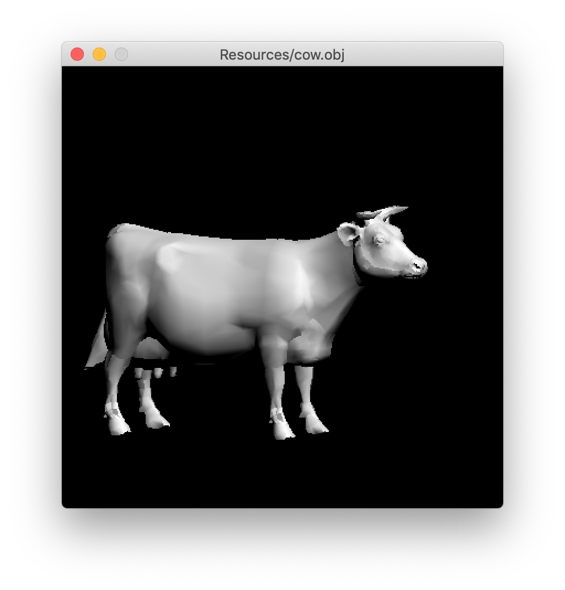
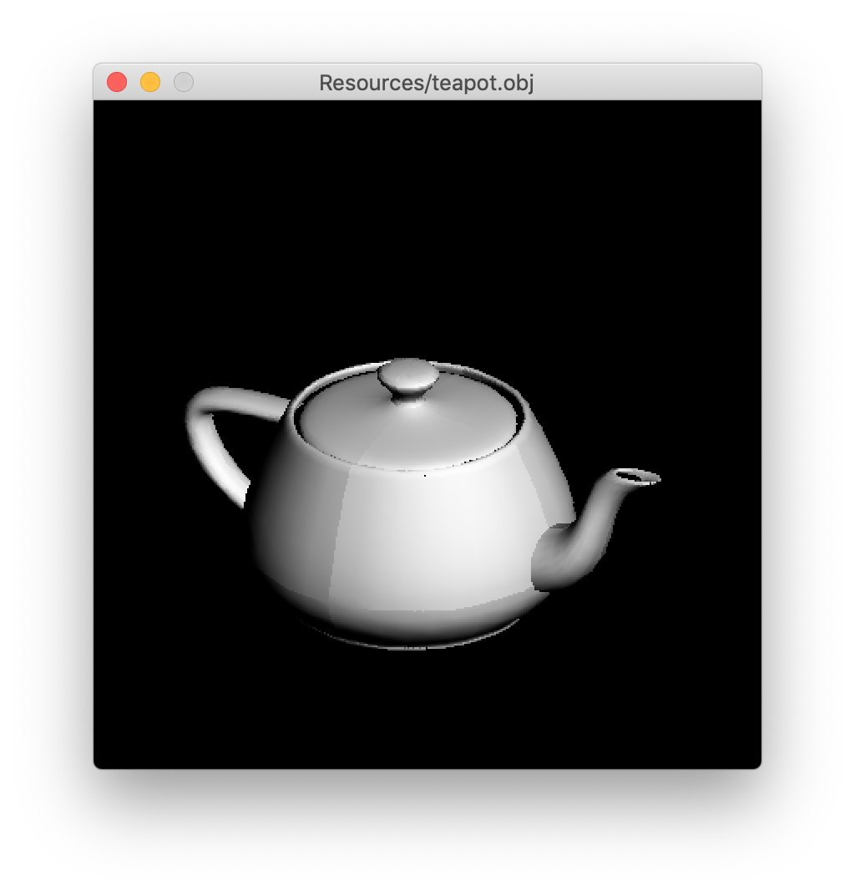
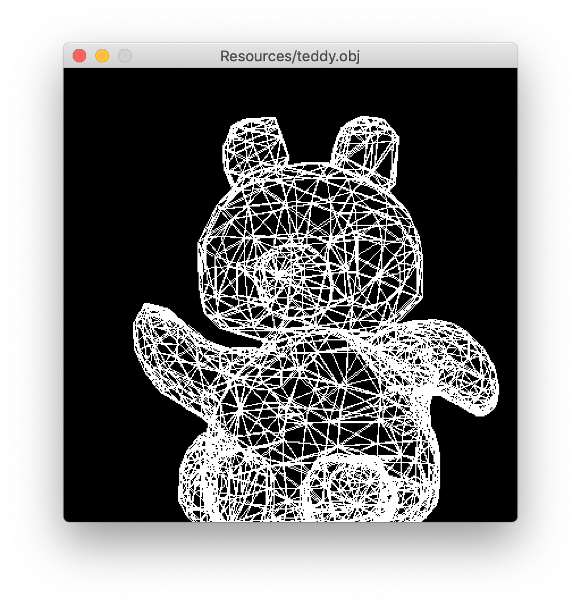
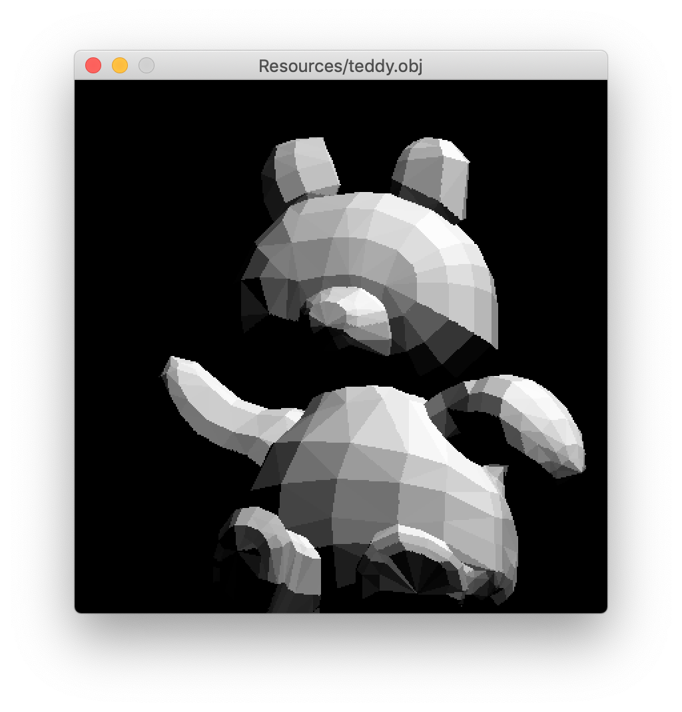
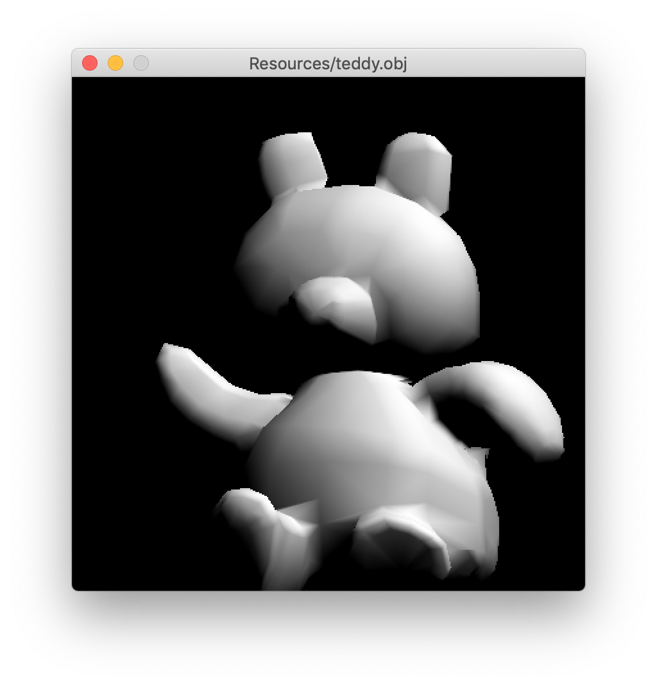
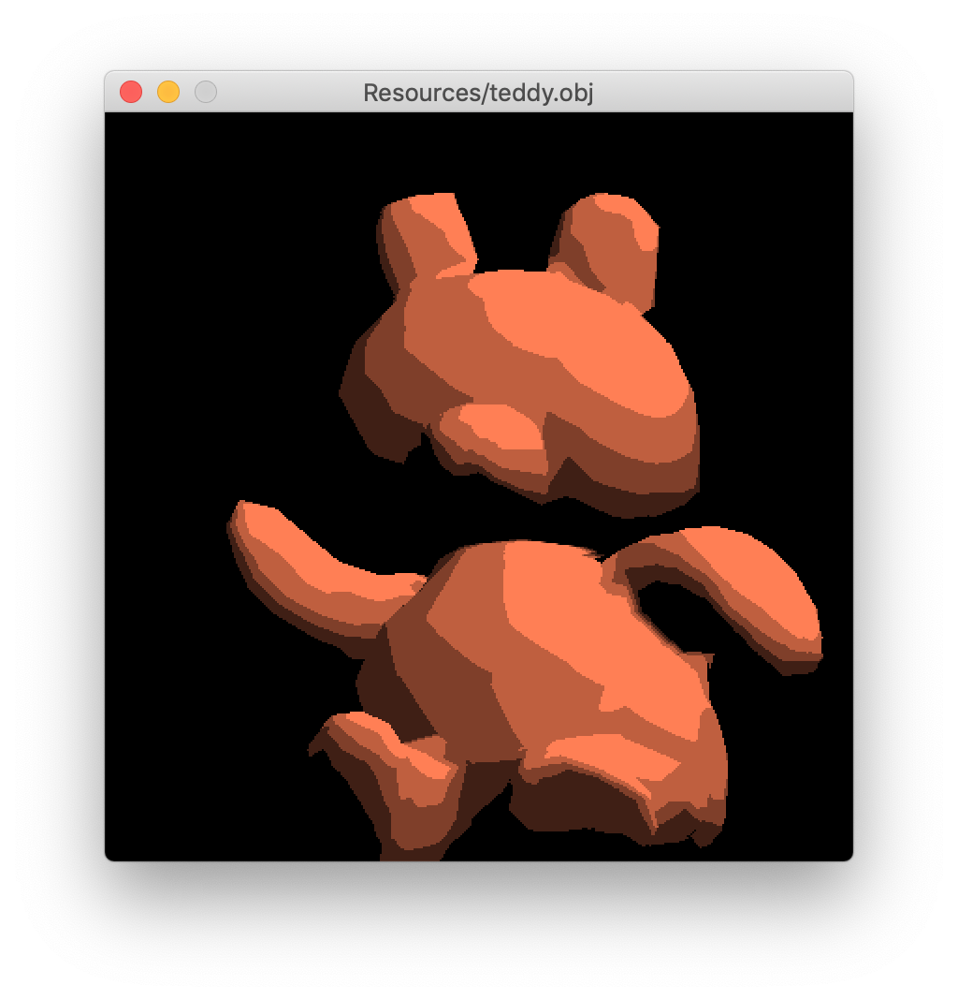

# QuickRender

A small, SDL2 based software renderer for 3D models




# Running

Currently this application is only tested on macOS (10.14+)

```bash
$ ./compile.sh
$ ./Build/QuickRender <obj-file>
```

# Dependencies

This program relies on SDL2.Framework to be installed on the system

# Keyboard Controls

| Key | Action |
| --- | ------ |
| W   | Rotate -roll
| S   | Rotate roll
| A   | Rotate -pitch
| D   | Rotate pitch
| Q   | Rotate -yaw
| E   | Rotate yaw
| 1   | Wireframe Mode
| 2   | Flat Shading Mode
| 3   | Gouraud Shading Mode
| 4   | Phong Shading Mode
| 5   | Toon Shading Mode

# Shading Modes

## Wireframe



## Flat Shading



## Gouraud Shading


## Phong Shading



## Toon Shading



# Caveats

- Quaternion rotation flip issue
- No zooming in/out when viewing models
- Shading is interpolation only, does not include any illumination model
  - Illumination models would only be added in conjunction with `.mtl` file parsing
- No texture support


# Resources

- [Learn OpenGL](https://www.learnopengl.com)
- [scratchapixel](https://www.scratchapixel.com/)
- [How To Open A Black Box](https://www.youtube.com/watch?v=SYomOZIfeoU)
- [Handmade Hero](https://www.youtube.com/user/handmadeheroarchive)
- [raviramamoorthi](https://www.youtube.com/channel/UCMXu0keYU3ZLR-aTNUJcRSQ)
- [Wavefront .obj Reference](http://paulbourke.net/dataformats/obj/)
